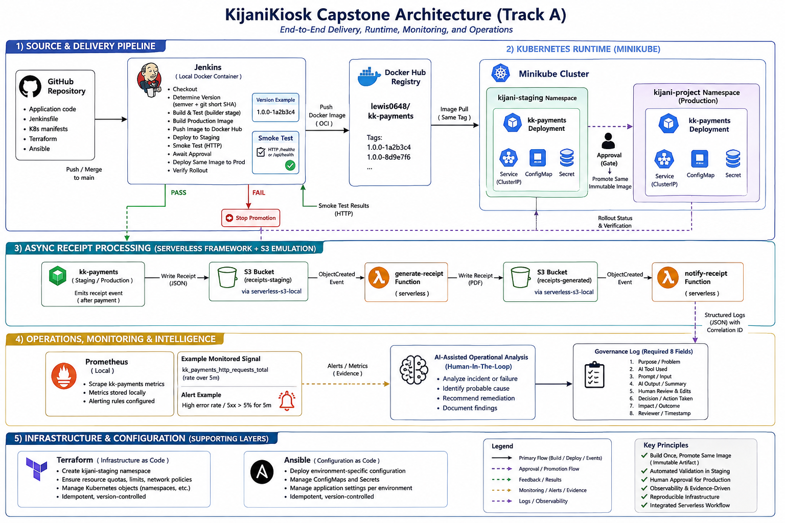

# KijaniKiosk Capstone

Infrastructure-first KijaniKiosk capstone integrating reproducible infrastructure, container-based CI/CD, Kubernetes deployment, monitoring, serverless receipt processing, and governed AI-assisted operations.

The project addresses the absence of a controlled staging-to-production delivery workflow for `kk-payments`. Changes are intended to be validated automatically in an isolated staging environment before the same immutable container image can be promoted to production through a human approval gate.

## Architecture



The system follows an infrastructure-first delivery model:

- **Terraform** provisions isolated staging and production Kubernetes namespaces.
- **Ansible** applies environment-specific configuration and Kubernetes registry credentials.
- **Jenkins** will build, test, publish, and promote container images through staging and production.
- **Minikube** hosts the isolated staging and production Kubernetes environments.
- **Docker Hub** will store immutable `kk-payments` container images tagged using semantic version and Git commit SHA.
- **Prometheus** will monitor a meaningful `kk-payments` health signal.
- **Serverless Framework** will provide asynchronous receipt processing.
- **AI-assisted operations** will be used for an operational task with documented human governance.

The detailed project scope is available in [`docs/scope.md`](docs/scope.md).

## Prerequisites

The current infrastructure and runtime setup requires:

- Git
- Docker
- Minikube
- `kubectl`
- Terraform
- Ansible
- Python 3 with virtual environment support
- Docker Hub account with access to the private `lewis0648/kk-payments` repository
- Docker Hub access token

The Ansible Kubernetes modules require the Python Kubernetes client. The tested version for this project is:

```text
kubernetes==36.0.3
```

Python dependencies are recorded in `requirements.txt`.

Additional Jenkins, Serverless Framework, and Prometheus requirements will be documented as those layers are implemented and verified.

## Setup

### 1. Clone the repository

```bash
git clone <repository-url>
cd kijani-capstone
```

### 2. Start Minikube

```bash
minikube start
```

Confirm that the cluster is running:

```bash
minikube status
kubectl config current-context
```

The expected Kubernetes context is:

```text
minikube
```

### 3. Create the Python environment

Create and activate an isolated Python virtual environment:

```bash
python3 -m venv .venv
source .venv/bin/activate
```

Install the required Python dependencies:

```bash
python -m pip install -r requirements.txt
```

### 4. Provision Kubernetes environments with Terraform

Initialize and validate the Terraform configuration:

```bash
cd terraform

terraform init
terraform validate
terraform plan
```

Review the plan before applying it:

```bash
terraform apply
```

Terraform provisions and manages two Kubernetes namespaces:

```text
kijani-staging
kijani-project
```

`kijani-staging` is the isolated staging environment and `kijani-project` is the production environment.

Verify the Terraform-managed infrastructure:

```bash
terraform output

kubectl get namespace kijani-staging --show-labels
kubectl get namespace kijani-project --show-labels

terraform state list
```

Return to the repository root:

```bash
cd ..
```

### 5. Configure Docker Hub credentials

The Kubernetes environments pull the private `kk-payments` image from Docker Hub.

Export the Docker Hub username and access token in the current shell:

```bash
export DOCKERHUB_USERNAME='lewis0648'
export DOCKERHUB_TOKEN='<your-docker-hub-access-token>'
```

Do not store the access token in the repository.

Ansible reads these environment variables and creates a `kubernetes.io/dockerconfigjson` Secret named:

```text
kijani-registry-credentials
```

in each target namespace.

### 6. Configure staging with Ansible

Run:

```bash
ansible-playbook \
  -i ansible/inventory/local.yml \
  ansible/playbook.yml \
  -e deploy_env=staging
```

Ansible:

1. validates the requested environment,
2. verifies that Terraform has already provisioned the target namespace,
3. creates or updates the environment-specific `kk-payments-config` ConfigMap, and
4. creates or updates the Docker Hub image pull Secret.

Verify the staging configuration:

```bash
kubectl get configmap kk-payments-config \
  -n kijani-staging \
  -o yaml
```

The staging configuration includes:

```text
PORT=3001
DB_HOST=postgres-staging.kijani.internal
NODE_ENV=staging
```

Verify the registry Secret metadata without exposing its contents:

```bash
kubectl get secret kijani-registry-credentials \
  -n kijani-staging
```

Its type should be:

```text
kubernetes.io/dockerconfigjson
```

### 7. Configure production with Ansible

Run the same playbook with the production environment selected:

```bash
ansible-playbook \
  -i ansible/inventory/local.yml \
  ansible/playbook.yml \
  -e deploy_env=production
```

Verify the production configuration:

```bash
kubectl get configmap kk-payments-config \
  -n kijani-project \
  -o yaml
```

The production configuration includes:

```text
PORT=3001
DB_HOST=postgres-prod.kijani.internal
NODE_ENV=production
```

Verify the production registry Secret:

```bash
kubectl get secret kijani-registry-credentials \
  -n kijani-project
```

Re-running either Ansible configuration without changing its inputs should be idempotent and report:

```text
changed=0
failed=0
```

### 8. Deploy `kk-payments` to staging

The Kubernetes Deployment and Service manifests do not contain a hard-coded namespace. The same manifests are therefore reusable across environments.

Deploy them to staging:

```bash
kubectl apply \
  -f k8s/kk-payments-deployment.yaml \
  -f k8s/kk-payments-service.yaml \
  -n kijani-staging
```

Wait for the Deployment to become healthy:

```bash
kubectl rollout status deployment/kk-payments \
  -n kijani-staging \
  --timeout=120s
```

Verify the workload:

```bash
kubectl get pods \
  -n kijani-staging \
  -l app=kk-payments

kubectl get service kk-payments \
  -n kijani-staging
```

### 9. Deploy `kk-payments` to production

Apply the exact same Kubernetes manifests to the production namespace:

```bash
kubectl apply \
  -f k8s/kk-payments-deployment.yaml \
  -f k8s/kk-payments-service.yaml \
  -n kijani-project
```

Wait for the production Deployment:

```bash
kubectl rollout status deployment/kk-payments \
  -n kijani-project \
  --timeout=120s
```

Verify the workload:

```bash
kubectl get pods \
  -n kijani-project \
  -l app=kk-payments

kubectl get service kk-payments \
  -n kijani-project
```

## How to Run the Pipeline

**Work in progress.**

The capstone delivery pipeline will:

1. check out the application source,
2. determine the release version using the `<semver>-<git-short-sha>` convention,
3. build and test `kk-payments`,
4. build the production Docker image,
5. push the immutable image to Docker Hub,
6. deploy that exact image automatically to `kijani-staging`,
7. wait for Kubernetes rollout completion,
8. run a staging HTTP smoke test,
9. expose a human production approval gate only after staging succeeds,
10. promote the same immutable image to production, and
11. verify the production rollout.

A failed staging deployment or smoke test will prevent production promotion.

This section will be replaced with the verified Jenkins procedure once the delivery layer is implemented.

## How to Verify It Works

### Verify Terraform-managed infrastructure

```bash
terraform -chdir=terraform output
terraform -chdir=terraform state list

kubectl get namespace kijani-staging --show-labels
kubectl get namespace kijani-project --show-labels
```

Terraform state should contain both namespace resources.

### Verify environment-specific configuration

Check staging:

```bash
kubectl get configmap kk-payments-config \
  -n kijani-staging \
  -o jsonpath='{.data.DB_HOST}{" | "}{.data.NODE_ENV}{"\n"}'
```

Expected:

```text
postgres-staging.kijani.internal | staging
```

Check production:

```bash
kubectl get configmap kk-payments-config \
  -n kijani-project \
  -o jsonpath='{.data.DB_HOST}{" | "}{.data.NODE_ENV}{"\n"}'
```

Expected:

```text
postgres-prod.kijani.internal | production
```

### Verify registry credentials exist

```bash
kubectl get secret kijani-registry-credentials \
  -n kijani-staging

kubectl get secret kijani-registry-credentials \
  -n kijani-project
```

Both Secrets should have type:

```text
kubernetes.io/dockerconfigjson
```

### Verify Kubernetes rollouts

```bash
kubectl rollout status deployment/kk-payments \
  -n kijani-staging \
  --timeout=120s

kubectl rollout status deployment/kk-payments \
  -n kijani-project \
  --timeout=120s
```

Both environments should contain three ready `kk-payments` Pods:

```bash
kubectl get pods -n kijani-staging -l app=kk-payments
kubectl get pods -n kijani-project -l app=kk-payments
```

### Verify runtime environment isolation

```bash
kubectl exec \
  -n kijani-staging \
  deploy/kk-payments \
  -- printenv NODE_ENV

kubectl exec \
  -n kijani-project \
  deploy/kk-payments \
  -- printenv NODE_ENV
```

Expected:

```text
staging
production
```

### Verify staging application health

Start a local port-forward:

```bash
kubectl port-forward \
  -n kijani-staging \
  service/kk-payments \
  3001:3001
```

From another terminal:

```bash
curl -s http://127.0.0.1:3001/health
```

The endpoint should return JSON indicating that `kk-payments` is healthy.

### Verify production application health

Start a separate port-forward:

```bash
kubectl port-forward \
  -n kijani-project \
  service/kk-payments \
  3002:3001
```

From another terminal:

```bash
curl -s http://127.0.0.1:3002/health
```

The endpoint should return JSON indicating that `kk-payments` is healthy.

### Current verified state

At the current implementation milestone:

- Terraform manages both Kubernetes namespaces.
- Staging and production configuration is managed by one Ansible playbook.
- Ansible configuration is idempotent.
- Staging and production use different `DB_HOST` and `NODE_ENV` values.
- Both namespaces contain Docker Hub image pull credentials created by Ansible.
- The same Kubernetes Deployment and Service manifests are reused across environments.
- Both Deployments run three healthy `kk-payments` replicas.
- Both `/health` endpoints respond successfully.

Pipeline, monitoring, serverless integration, structured logging, correlation-ID tracing, and AI-assisted operational verification will be added as those layers are implemented.

## Known Limitations

The capstone is currently under active implementation.

The target system is production-approaching rather than a customer-ready production platform. The following are deliberately outside the project scope:

- Managed Kubernetes platforms such as Amazon EKS.
- Multi-region high availability and disaster recovery.
- External secrets-management platforms such as HashiCorp Vault.
- A complete production observability stack incorporating metrics, logs, traces, dashboards, and distributed alert management.

The current implementation also has the following temporary limitation:

- The deployed baseline image reports `v1.0.0-local` from `/health`. Release identity will be corrected when the Jenkins pipeline is redesigned to build and promote immutable `<semver>-<git-short-sha>` Docker images.

Additional implementation-specific limitations will be documented as they are discovered.
